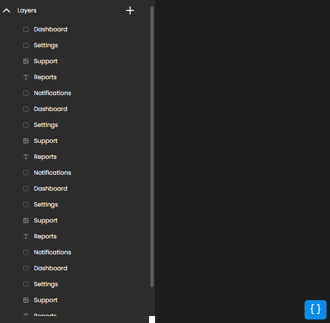

# 🌳 Nested Menu React Component

A flexible, customizable nested menu component for React applications with drag-and-drop functionality and real-time JSON visualization.




## ✨ Features

- 🎯 Drag and drop functionality for intuitive item organization
- 🔄 Dynamic nested structure supporting multiple levels
- ✏️ Double-click to edit item names
- 🎨 Customizable styling through CSS variables
- 📊 Real-time JSON structure visualization
- 🎭 Multiple item types (Container, Text, Image)
- 🗑️ Easy item deletion
- 📱 Responsive design

## 🚀 Installation

```bash
# Clone the repository
git clone https://github.com/AlexOliveiraaDev/nested-menu-reactjs

# Navigate to project directory
cd nested-menu-reactjs

# Install dependencies
npm install

# Start development server
npm run dev
```

## 💻 Usage

First, create a JSON configuration file for your menu structure:

```json
[
  {
    "items": [
      {
        "name": "Container 1",
        "icon": "SquareDashed",
        "children": [
          {
            "name": "Text Item",
            "icon": "Type"
          },
          {
            "name": "Image Item",
            "icon": "Image"
          }
        ]
      }
    ]
  }
]
```

Then import and use the component:

```jsx
import NestedMenu from "./components/nested-menu/NestedMenu";
import menuConfig from "./config/menu-config.json";

function App() {
  return (
    <div>
      <NestedMenu items={menuConfig.items} />
    </div>
  );
}
```

## 🎨 Customization

### Styling

You can customize the appearance by modifying the CSS variables in your stylesheet:

```css
:root {
  --bg-color: #2c2c2c;
  --bg-color-overlay: #383838;
  --border-color: #444444;
  --text-color: white;
  --bg-color-active: #606060;
  --bg-item-color-selected: #0c8ce9;
  --item-icon-color: #a1a1a1;
  --dropdown-background-color: #1e1e1e;
  --dropdown-background-item-hover: #096ab0;
}
```

### Adding New Item Types

To add new types of items to your menu, you'll need to modify two files:

1. In `NestedMenuItem.jsx`, add your new icon and case:

```jsx
import { SquareDashed, Type, Image, FileText, Link } from "lucide-react"; // Add new icons

function setIcon(icon) {
  switch (icon) {
    case "SquareDashed":
      return <SquareDashed className="menu-item-icon" />;
    case "Type":
      return <Type className="menu-item-icon" />;
    case "Image":
      return <Image className="menu-item-icon" />;
    // Add new cases here
    case "Document":
      return <FileText className="menu-item-icon" />;
    case "Link":
      return <Link className="menu-item-icon" />;
    default:
      return <SquareDashed className="menu-item-icon" />;
  }
}
```

2. In `NestedMenuDropdown.jsx`, add your new items:

```jsx
import { SquareDashed, Type, Image, FileText, Link } from "lucide-react";

const NestedMenuDropdown = ({ onClick }) => {
  return (
    <div className="main-dropdown-div">
      <div className="dropdown-row" onClick={() => onClick(0)}>
        <SquareDashed />
        <span>Container</span>
      </div>
      <div className="dropdown-row" onClick={() => onClick(1)}>
        <Type />
        <span>Text</span>
      </div>
      <div className="dropdown-row" onClick={() => onClick(2)}>
        <Image />
        <span>Image</span>
      </div>
      {/* Add new items here */}
      <div className="dropdown-row" onClick={() => onClick(3)}>
        <FileText />
        <span>Document</span>
      </div>
      <div className="dropdown-row" onClick={() => onClick(4)}>
        <Link />
        <span>Link</span>
      </div>
    </div>
  );
};
```

3. Update the `handleClickDropdown` function in `NestedMenu.jsx`:

```jsx
const handleClickDropdown = (e) => {
  toggleDropdown();
  const newId = generateUUID();
  const newItems = [
    { name: "New Container", icon: "SquareDashed", id: newId },
    { name: "New Text", icon: "Type", id: newId },
    { name: "New Image", icon: "Image", id: newId },
    { name: "New Document", icon: "Document", id: newId },
    { name: "New Link", icon: "Link", id: newId },
  ];
  if (e >= 0 && e < newItems.length) addItem(newItems[e]);
};
```

## 🛠️ Component Structure

```
nested-menu/
├── NestedMenu.jsx         # Main component
├── NestedMenuHeader.jsx   # Header with collapse/expand
├── NestedMenuItem.jsx     # Individual menu item
├── NestedMenuList.jsx     # List container
├── NestedMenuDropdown.jsx # Add item dropdown
└── CodeWindow.jsx         # JSON viewer
```

## 📝 Features in Detail

### Drag and Drop

- Items can be dragged to reorder or nest within containers
- Maximum nesting depth of 2 levels
- Visual feedback during drag operations

### Item Management

- Add new items through the + button
- Three item types by default: Container, Text, and Image
- Extensible to support more item types
- Double-click to rename items
- Delete items with the trash icon

### JSON Visualization

- Real-time view of the menu structure
- Syntax-highlighted JSON display
- Toggle view with the { } button

## 🤝 Contributing

Contributions are welcome! Feel free to:

1. Fork the repository
2. Create a feature branch (`git checkout -b feature/amazing-feature`)
3. Commit your changes (`git commit -m 'Add amazing feature'`)
4. Push to the branch (`git push origin feature/amazing-feature`)
5. Open a Pull Request

## 📄 License

This project is licensed under the MIT License.

## 🙏 Acknowledgments

- [dnd kit](https://dndkit.com/) for the drag and drop functionality
- [Lucide React](https://lucide.dev/) for the beautiful icons
- [PrismJS](https://prismjs.com/) for code syntax highlighting

---

Made with ❤️ by [Alex Oliveira](https://github.com/AlexOliveiraaDev)
